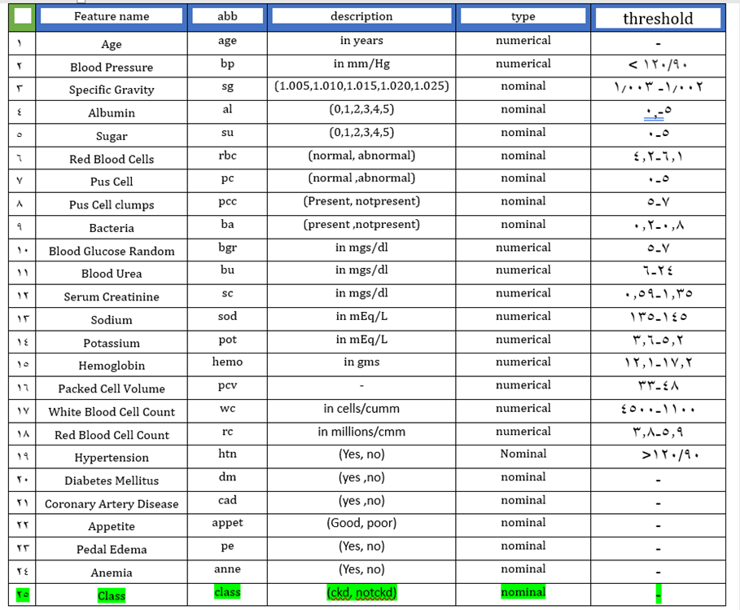

# kidney-disease-data-mining
# Data Defining
The data was taken over a 2-month period in India with 25 features ( eg, red blood cell count, white blood cell count, etc).

The target is the 'classification', which is either 'ckd' or 'notckd' - ckd=chronic kidney disease. Use machine learning techniques to predict if a patient is suffering from a chronic kidney disease or not.

Credit goes to Mansoor Iqbal (https://www.kaggle.com/mansoordaku) from where the dataset has been collected. For the purpose of creating a challenge, certain modifications have been done to the dataset.
Original dataset can be acquired from the link Chronic KIdney Disease (https://www.kaggle.com/mansoordaku/ckdisease)

Dataset is a classification problem and has sevral feartures and one class which predict a patient is suffering from a chronic kidney disease or not.
# Attribute information

